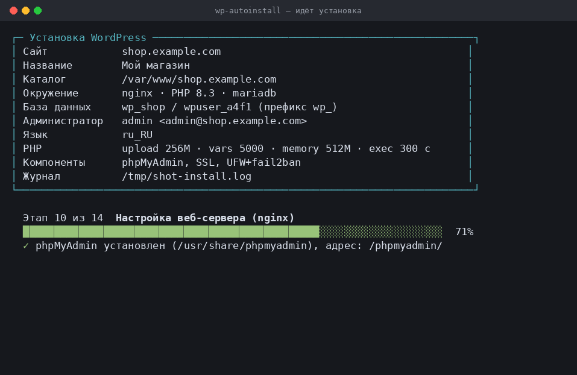
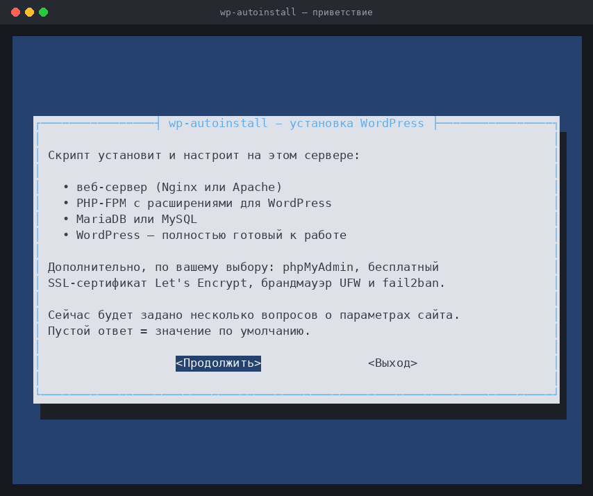
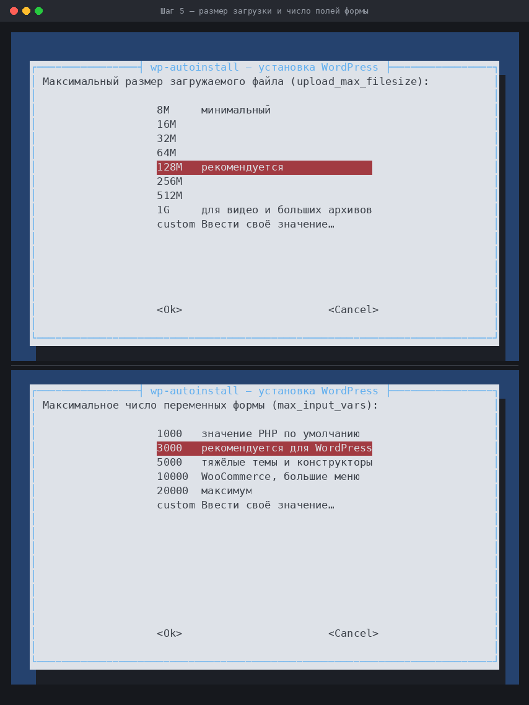
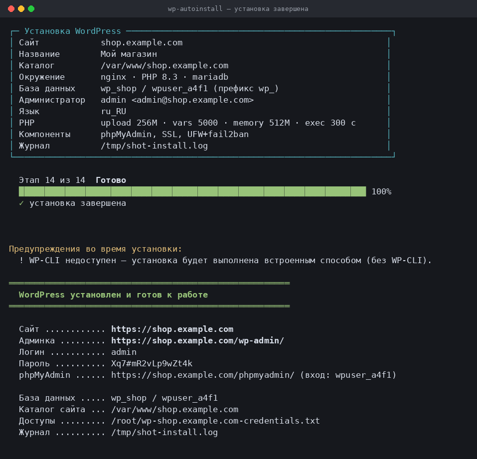

# wp-autoinstall

[](LICENSE)
[](#совместимость)
[](#разработка)

Установка WordPress на чистый сервер Ubuntu или Debian **одной командой**.

Скрипт спрашивает параметры в псевдографическом окне (как у `raspi-config`), ставит
веб-сервер, PHP, базу данных и полностью готовый к работе WordPress — заходить в
веб-установщик и что-то донастраивать не нужно.



```bash
git clone https://github.com/perov4265-web/WP.git
cd WP
sudo ./install.sh
```

Через несколько минут сайт открывается по адресу `http://ваш-домен/`, а панель
управления — по `http://ваш-домен/wp-admin/` с логином и паролем, которые вы указали.

Репозиторий публичный: `git clone` по HTTPS работает без логина, пароля и токена.
Если на сервере нет git — можно скачать архивом, тоже без авторизации:

```bash
curl -fsSL https://github.com/perov4265-web/WP/archive/refs/heads/main.tar.gz | tar -xz
cd WP-main
sudo ./install.sh
```

---

## Содержание

- [Что делает скрипт](#что-делает-скрипт)
- [Совместимость](#совместимость)
- [Псевдографический интерфейс](#псевдографический-интерфейс)
- [Экран установки](#экран-установки)
- [Какие параметры спрашиваются](#какие-параметры-спрашиваются)
- [Файл параметров: без nano и vim](#файл-параметров-без-nano-и-vim)
- [Автоматический режим](#автоматический-режим-без-вопросов)
- [Устойчивость под нагрузкой](#устойчивость-под-нагрузкой)
- [Что получается на выходе](#что-получается-на-выходе)
- [Повторный запуск и удаление](#повторный-запуск-и-удаление)
- [Частые вопросы](#частые-вопросы)
- [Разработка](#разработка)

---

## Что делает скрипт

| Шаг | Что происходит |
|-----|----------------|
| 1 | Спрашивает параметры: домен, название сайта, имя БД, логины и пароли, email |
| 2 | Ставит **Nginx** или **Apache** (на выбор) |
| 3 | Ставит **PHP-FPM** с расширениями для WordPress и настраивает лимиты |
| 4 | Ставит **MariaDB** или **MySQL**, создаёт базу и пользователя |
| 5 | Скачивает WordPress нужной локали, пишет `wp-config.php` с уникальными ключами |
| 6 | **Полностью устанавливает WordPress**: создаёт администратора, включает ЧПУ-ссылки, ставит языковой пакет |
| 7 | По желанию: **phpMyAdmin**, **SSL Let's Encrypt**, **UFW + fail2ban** |
| 8 | Выставляет права на файлы и сохраняет все доступы в файл `/root/wp-ДОМЕН-credentials.txt` |

## Совместимость

- **Ubuntu 20.04, 22.04, 24.04, 26.04** и новее, **Debian 11/12** и производные
  от них дистрибутивы. Если система apt-совместимая, но скрипту незнакома —
  запускайте с ключом `--skip-os-check`.
- **Любая версия PHP.** По умолчанию берётся версия из репозитория системы
  (7.4 на 20.04, 8.1 на 22.04, 8.3 на 24.04 и т. д.). Версия PHP-FPM, имя службы и
  путь к сокету определяются автоматически — ничего прописывать руками не нужно.
  Можно выбрать конкретную версию (`--php-version 8.3`); если её нет в репозитории,
  скрипт предложит подключить `ppa:ondrej/php`.
- **Любая версия MySQL / MariaDB.** Скрипт сам находит установленную СУБД, определяет
  способ входа под root (сокет, пароль или служебная учётная запись Debian) и работает
  и с MariaDB, и с MySQL 5.7/8.x.
- Если Nginx, PHP или база уже установлены — они используются, а не переустанавливаются.

---

## Псевдографический интерфейс



Если в системе есть `whiptail` (ставится автоматически), параметры спрашиваются в
диалоговых окнах: поля ввода, скрытый ввод паролей, меню выбора и список компонентов
с галочками. В неинтерактивном режиме или при `--no-tui` используется обычный
текстовый ввод с теми же вопросами и нумерованными списками.



Меню выглядит так же и в текстовом режиме, только пункты выбираются по номеру:

```
 ┌───────────── wp-autoinstall — установка WordPress ─────────────┐
 │  Максимальный размер загружаемого файла (upload_max_filesize): │
 │        ┌────────────────────────────────────────────┐          │
 │        │  8M     минимальный                        │          │
 │        │  64M                                       │          │
 │        │  128M   рекомендуется                      │          │
 │        │  256M                                      │          │
 │        │  1G     для видео и больших архивов        │          │
 │        │  custom Ввести своё значение…              │          │
 │        └────────────────────────────────────────────┘          │
 │              <  Ок  >            <Отмена>                      │
 └────────────────────────────────────────────────────────────────┘
```

## Экран установки

После подтверждения параметров экран перестаёт прокручиваться. Сверху остаётся
рамка с параметрами установки, снизу — прогресс-бар, название текущего этапа и
строка пояснений; все три обновляются на одном и том же месте.

```
┌─ Установка WordPress ────────────────────────────────────────────────────┐
│ Сайт            shop.example.com                                         │
│ Название        Мой магазин                                              │
│ Каталог         /var/www/shop.example.com                                │
│ Окружение       nginx · PHP auto · mariadb                               │
│ База данных     wp_shop / wpuser_ab12 (префикс wp_)                      │
│ Администратор   admin <admin@example.com>                                │
│ Язык            ru_RU                                                    │
│ PHP             upload 256M · vars 5000 · memory 512M · exec 300 c       │
│ Компоненты      phpMyAdmin, SSL                                          │
│ Журнал          /var/log/wp-autoinstall.log                              │
└──────────────────────────────────────────────────────────────────────────┘

  Этап 8 из 14  Создание wp-config.php
  ███████████████████████████████████░░░░░░░░░░░░░░░░░░░░░░░░░░░░░░░░  57%
  › загрузка ключей безопасности
```

Подробности (вывод apt, ошибки команд, все шаги) пишутся в `/var/log/wp-autoinstall.log`,
поэтому экран остаётся чистым. Предупреждения, если они были, показываются списком
после завершения.

Если во время установки понадобится ответить на вопрос (например, база с таким
именем уже существует), экран временно освобождается и после ответа перерисовывается.

Экран включается сам, когда установка идёт в терминале. Он отключается и заменяется
обычным построчным выводом, если запуск идёт не из терминала (cron, CI, пайп), а также
при `--plain` или `-v` (подробный вывод).

## Какие параметры спрашиваются

**Сайт:** домен или IP, название сайта, язык WordPress, каталог сайта.
**Доступы:** логин, пароль и email администратора WordPress.
**База данных:** имя базы, пользователь, пароль, префикс таблиц.
**Окружение:** веб-сервер (Nginx/Apache), СУБД (MariaDB/MySQL/авто), версия PHP.

**Параметры PHP — выбираются из готового списка или задаются вручную:**

| Параметр | Варианты в меню |
|----------|-----------------|
| `upload_max_filesize` | 8M · 16M · 32M · 64M · **128M** · 256M · 512M · 1G · своё значение |
| `max_input_vars` | 1000 · **3000** · 5000 · 10000 · 20000 · своё значение |
| `memory_limit` | 128M · **256M** · 512M · 768M · 1G · своё значение |
| `max_execution_time` | 30 · 60 · 120 · **300** · 600 · своё значение |

`post_max_size` считается автоматически (вдвое больше `upload_max_filesize`), а
`client_max_body_size` в Nginx и `WP_MEMORY_LIMIT` в WordPress приводятся в соответствие.

**Дополнительные компоненты** (список с галочками): phpMyAdmin, SSL Let's Encrypt, UFW + fail2ban.

Пустой ответ всегда означает «оставить значение по умолчанию», а пустой пароль —
«сгенерировать надёжный случайный пароль».

---

## Файл параметров: без nano и vim

Ответы мастера можно сохранить в файл и потом переиспользовать. В конце опроса
скрипт сам предложит это сделать, либо задайте путь заранее:

```bash
sudo ./install.sh --save-config /root/shop.conf
```

Отдельный режим — пройти только мастер, ничего не устанавливая:

```bash
sudo ./install.sh --configure /root/shop.conf
```

Если файл уже существует, его значения подставляются как ответы по умолчанию:
жмёте Enter там, где менять нечего, и правите только нужное. Файл переписывается
целиком, но значения, которые вы не трогали, остаются прежними — пароли в том
числе. Так параметры меняются пошагово, а не правкой файла руками.

Файл создаётся с правами `600` и содержит пароли — в git его класть не нужно
(в `.gitignore` уже стоит исключение для `*.conf`).

## Автоматический режим (без вопросов)

Готовый файл параметров ставит сайт молча:

```bash
sudo ./install.sh -c /root/shop.conf --yes
```

Либо начните с образца и заполните руками:

```bash
cp config.example.conf my-site.conf
nano my-site.conf
sudo ./install.sh -c my-site.conf -y
```

Либо передать всё опциями:

```bash
sudo ./install.sh \
  --domain shop.example.com \
  --title "Мой магазин" \
  --email admin@example.com \
  --db-name wp_shop --db-user wp_shop --db-pass 'Strong#Pass123' \
  --admin-user manager --admin-pass 'Admin#Pass123' \
  --web-server nginx --php-version auto \
  --upload-max 256M --max-input-vars 5000 --memory-limit 512M \
  --phpmyadmin --ssl --firewall --yes
```

Полный список опций: `./install.sh --help`.

Ключ командной строки всегда важнее файла параметров: `-c site.conf --no-cache`
выключит кэш, даже если в файле он включён.

### Основные опции

| Опция | Назначение |
|-------|-----------|
| `-c, --config ФАЙЛ` | Взять параметры из файла |
| `-y, --yes` | Ничего не спрашивать, недостающие пароли сгенерировать |
| `-v, --verbose` | Показывать вывод apt и остальных команд |
| `--tui` / `--no-tui` | Псевдографические окна вопросов |
| `--plain` | Без экрана установки: обычный построчный вывод |
| `--save-config ФАЙЛ` | Записать ответы мастера в файл и продолжить установку |
| `--configure [ФАЙЛ]` | Только мастер: создать или пошагово поправить файл параметров |
| `--skip-os-check` | Не проверять дистрибутив |
| `--cache` / `--no-cache` | Кэш готовых страниц в nginx |
| `--swap` / `--no-swap`, `--swap-size` | Файл подкачки |
| `--fpm-children`, `--fpm-timeout` | Пул PHP-FPM вручную |
| `--db-time`, `--search-rate` | Обрыв тяжёлого SQL и лимит на поиск |
| `--extra-conf ФАЙЛ` | Свои правила веб-сервера |
| `--ssh-from АДРЕС` | Открыть SSH только с этого IP |
| `--debug-wp`, `--no-robots` | Журнал ошибок WordPress, отказ от robots.txt |
| `--force` | Перезаписывать существующий сайт и базу без вопросов |
| `--web-server nginx\|apache` | Веб-сервер |
| `--php-version 8.3\|auto` | Версия PHP |
| `--db-engine mariadb\|mysql\|auto` | СУБД |
| `--upload-max`, `--max-input-vars`, `--memory-limit`, `--max-exec-time` | Параметры PHP |
| `--phpmyadmin`, `--ssl`, `--firewall` | Дополнительные компоненты (есть и `--no-…`) |

---

## Устойчивость под нагрузкой

Раздел появился после разбора реального падения: сайт «лежал» при живом сервере.
PHP-FPM по умолчанию поднимает пять воркеров; несколько медленных запросов
занимали их все, nginx ждал бэкенд, снаружи это выглядело как недоступность.
Медленными были запросы штатного поиска WordPress — на базе в 46 тысяч записей
он выполняется по две-три минуты. Хватало восьми таких запросов в сутки.

Что скрипт делает по умолчанию:

**Пул PHP-FPM считается от объёма памяти.** Из RAM вычитается доля системы и
кэша СУБД, остаток делится на средний размер воркера. На сервере с 4 ГБ выходит
около двадцати воркеров вместо пяти. Значение переопределяется ключом
`--fpm-children`.

**Запрос не может висеть вечно.** `request_terminate_timeout` обрывает зависший
воркер, `max_statement_time` в MariaDB (в MySQL — `max_execution_time`) убивает
тяжёлый SQL через 30 секунд и освобождает воркер. Это главная страховка: без неё
один медленный запрос держит воркер минутами.

**Поиск ограничен по частоте.** `limit_req` в nginx применяется только к запросам
с параметром `?s=` — ключ зоны для остальных страниц пуст, так что обычную
навигацию лимит не трогает. Темп задаётся ключом `--search-rate`.

**Медленное видно сразу.** Формат лога nginx включает `$request_time`, PHP-FPM
пишет `slowlog` с порогом 5 секунд, СУБД — `slow_query_log` с порогом 3 секунды.
Медленные ответы ищутся одной командой, без `SHOW PROCESSLIST`.

**Файл подкачки.** Если swap не настроен, скрипт предложит создать его: при
нехватке памяти без swap первой падает СУБД.

**robots.txt** закрывает от индексации поиск и админку, оставляя `admin-ajax.php`.

Необязательно, спрашивается при установке:

**Кэш готовых страниц** (`fastcgi_cache` в nginx). Боты и анонимные посетители
получают HTML, не доходя до PHP и базы. Не кэшируются POST-запросы, админка,
ленты и всё, что открыто из-под авторизации. Статус кэша виден в заголовке
`X-FastCGI-Cache`.

### Свои правила веб-сервера

Установщик создаёт каталог `/etc/nginx/wp-autoinstall/ДОМЕН.d/` и подключает его
в конфиг сайта. Файлы оттуда переживают повторный прогон скрипта — он их не
перезаписывает. Туда кладутся редиректы и заглушки адресов старого сайта.

Это важно при переезде с другой CMS: штатное правило WordPress `^/search/(.+)` → `?s=$1`
превращает любой старый адрес вида `/search/что-угодно` в полнотекстовый поиск
по всей базе.
Готовый пример с пояснениями — в [extras/legacy-urls.conf.example](extras/legacy-urls.conf.example);
подключить можно и при установке: `--extra-conf путь/к/файлу.conf`.

### Проверка состояния

Скрипт ставит команду `wp-autoinstall-check` и запускает её в конце установки:

```bash
sudo wp-autoinstall-check example.com
```

Показывает код и время ответа сайта, применившиеся лимиты PHP-FPM и СУБД,
зависшие запросы, открытые наружу порты, медленные ответы из лога и состояние
подкачки. Через сутки эксплуатации её полезно запустить ещё раз.

## Что получается на выходе



```
/var/www/ДОМЕН/                       — файлы сайта (владелец www-data)
/etc/nginx/sites-available/ДОМЕН.conf — конфигурация Nginx (или /etc/apache2/…)
/etc/php/ВЕРСИЯ/fpm/conf.d/99-wordpress.ini — лимиты PHP
/root/wp-ДОМЕН-credentials.txt        — все доступы, права 600
/var/log/wp-autoinstall.log           — подробный журнал установки
/etc/nginx/conf.d/00-wp-autoinstall.conf      — формат лога, лимит поиска, зона кэша
/etc/nginx/wp-autoinstall/ДОМЕН.d/            — сюда кладутся свои правила
/var/log/php ВЕРСИЯ -fpm-slow.log             — медленные запросы PHP
/var/log/mysql/slow.log                       — медленные запросы к базе
```

Настройки безопасности, которые применяются сразу:

- запрет выполнения PHP в каталоге загрузок;
- закрытый доступ к `wp-config.php`, `xmlrpc.php` и скрытым файлам;
- `DISALLOW_FILE_EDIT` — редактор кода в админке отключён;
- заголовки `X-Frame-Options`, `X-Content-Type-Options`, `Referrer-Policy`;
- уникальные ключи и соли WordPress, случайные пароли;
- каталоги 755, файлы 644, `wp-config.php` 640.

## Повторный запуск и удаление

Скрипт можно запускать повторно — он заметит существующую базу или непустой каталог
и спросит, что делать (перед удалением делается резервная копия в `/root/`).

Удалить сайт целиком:

```bash
sudo ./uninstall.sh --domain example.com --db-name wp_site --db-user wp_user
```

Каталог сайта архивируется, база выгружается в дамп — обе копии остаются в `/root/`.

---

## Частые вопросы

**Домена ещё нет, только IP.** Укажите IP-адрес — сайт заработает по нему. Когда
домен будет направлен на сервер, запустите скрипт ещё раз с `--domain ваш.домен --ssl`.

**Сертификат не выпустился.** Let's Encrypt проверяет домен по HTTP: убедитесь, что
A-запись указывает на этот сервер и порт 80 открыт, затем повторите:
`sudo certbot --nginx -d ваш.домен`.

**Нужен PHP другой версии.** `sudo ./install.sh --php-version 8.2` — при отсутствии
пакета скрипт предложит подключить `ppa:ondrej/php`.

**Где посмотреть пароли.** `sudo cat /root/wp-ДОМЕН-credentials.txt`.

**Что пошло не так.** Подробный журнал: `/var/log/wp-autoinstall.log`.

---

## Разработка

```bash
shellcheck -x -S warning install.sh uninstall.sh lib/*.sh   # статический анализ
sudo bash tests/smoke-test.sh                               # прогон с заглушками
```

`tests/smoke-test.sh` подменяет `apt`, `systemctl`, `mysql` и `curl` заглушками,
прогоняет установщик целиком и проверяет содержимое сгенерированных файлов
(`wp-config.php`, `99-wordpress.ini`, конфигурации Nginx и Apache). Запускать только
в одноразовой виртуальной машине или контейнере. То же самое выполняется в GitHub
Actions при каждом push.

### Структура проекта

```
install.sh              точка входа: порядок шагов установки
uninstall.sh            удаление сайта и базы
config.example.conf     образец файла параметров
lib/common.sh           вывод, журнал, валидация, текстовый ввод
lib/ui.sh               псевдографический интерфейс (whiptail) и меню
lib/prompts.sh          опции командной строки, чтение конфига, опрос параметров
lib/packages.sh         установка пакетов, определение версий PHP и СУБД
lib/database.sh         подключение к MySQL/MariaDB, создание базы и пользователя
lib/wordpress.sh        загрузка WordPress, wp-config.php, установка ядра, права
lib/webserver.sh        конфигурация Nginx и Apache
lib/tuning.sh           пул PHP-FPM, настройка СУБД, swap, robots.txt, health-check
lib/extras.sh           phpMyAdmin, SSL, UFW + fail2ban, итоговая сводка
tests/smoke-test.sh     проверка логики без реальной установки
extras/                 необязательные готовые правила веб-сервера
```

## Участие в проекте

Ошибки и предложения — в [issues](https://github.com/perov4265-web/WP/issues),
правки — pull request'ом. Что проверить перед отправкой, написано в
[CONTRIBUTING.md](CONTRIBUTING.md).

История изменений — [CHANGELOG.md](CHANGELOG.md).
Вопросы безопасности — [SECURITY.md](SECURITY.md).

## Лицензия

MIT — см. [LICENSE](LICENSE).
